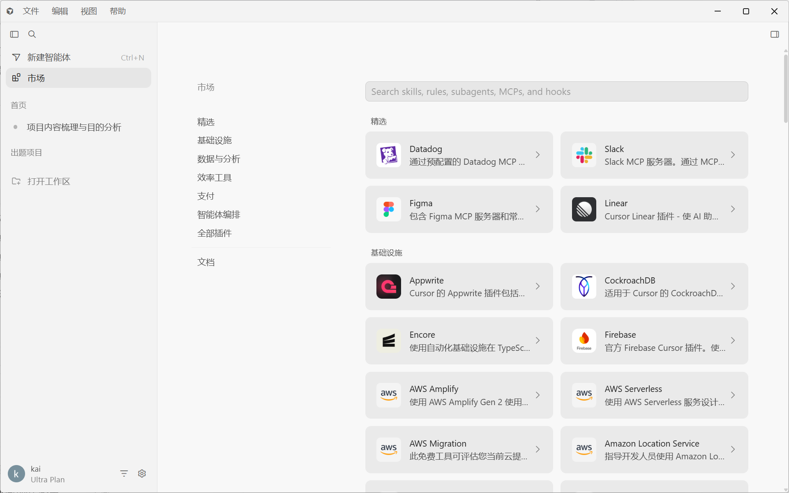
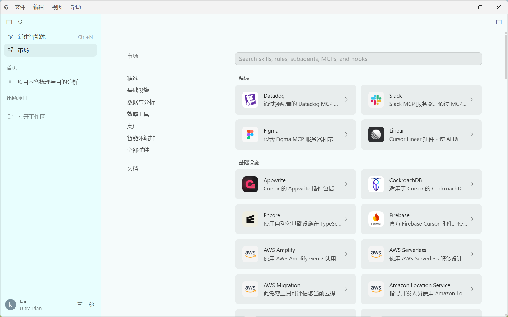
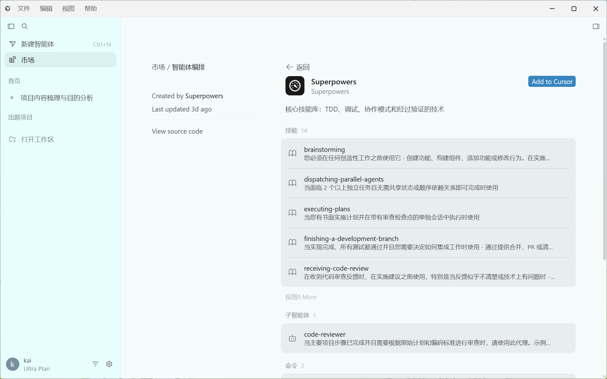
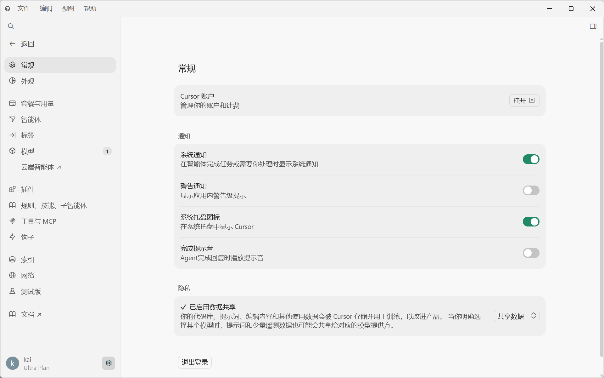
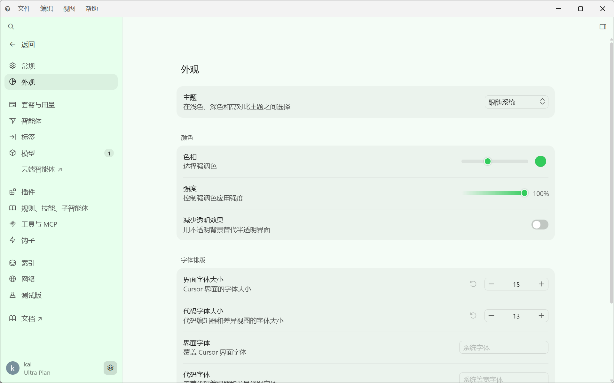
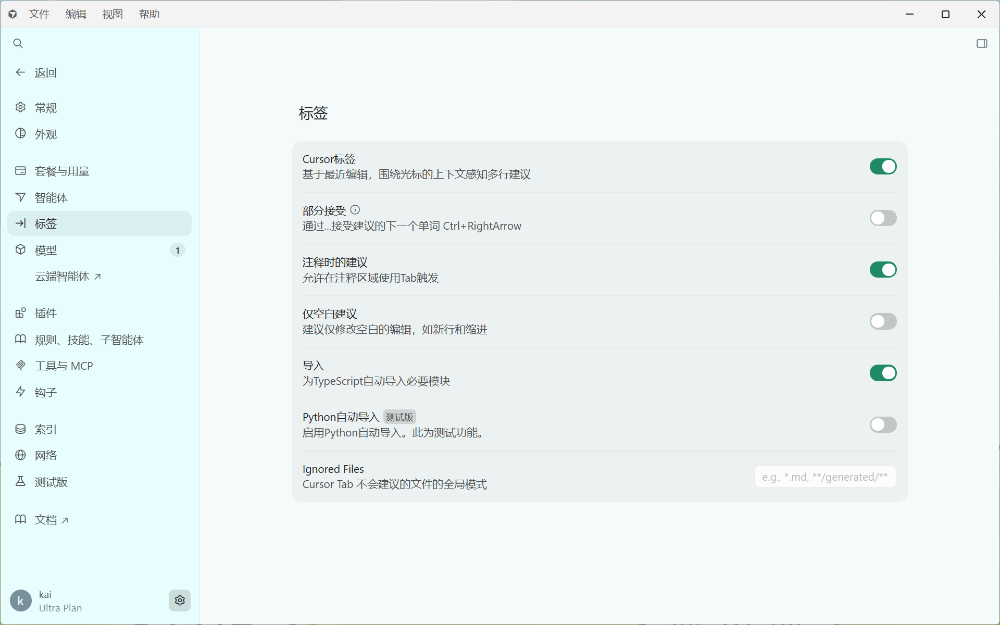
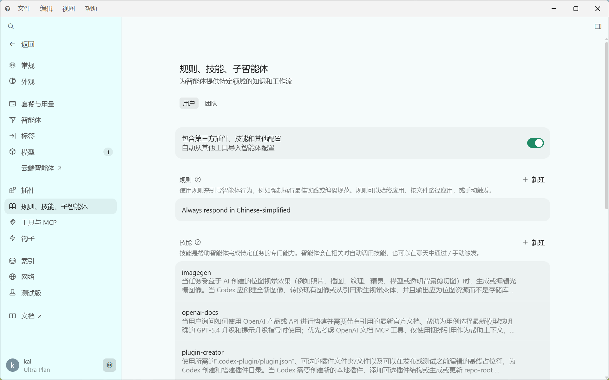

# Cursor 中文增强包

[](LICENSE)
[](https://github.com/rainiva/Cursor-zh)

面向 **Windows Cursor** 的第三方汉化增强工具仓库。

**仓库地址：** https://github.com/rainiva/Cursor-zh

它不是 Cursor 官方产品，也不是 Cursor Marketplace 插件。它的定位是：

- 可审查源码的独立工具仓库
- 对 Codex / Cursor / Claude 等 agent 友好的自动安装方案
- 可持续维护、可重新安装 / 完整卸载的 Cursor 中文增强工具

## 适用范围

- 已支持：Windows 上的 Cursor（含 Glass 界面 `workbench.glass.main.js`）
- 已验证版本：
  - Cursor `3.8.11`
  - VS Code 内核 `1.105.1`
  - 官方中文语言包 `1.105.0`
- 其他版本通常也可使用，安装后建议运行 `doctor.ps1` 验证兼容性

## 仓库包含什么

- 汉化核心脚本（`scripts/lib/` 领域逻辑 + `scripts/tool/` CLI 编排）
- 翻译词库与运行时规则（静态替换 + 运行时 DOM 翻译）
- 安装、诊断、卸载、打包脚本
- 面向人类和 agent 的安装文档
- GitHub Actions 工作流

## 默认模式

从 `v0.1.2` 开始，默认采用**轻量汉化模式**（balanced），目标是尽量保留可见中文，同时减少卡顿感。

轻量模式默认会：

- 保留静态汉化和大部分安全的运行时中文覆盖
- 保留设置页、Marketplace 壳层、Glass 聊天 / 画布 / 上下文用量等 UI 汉化
- 关闭 Marketplace 第三方描述的在线自动翻译
- 取消持续性的定时全局扫描，改成有限次数的补扫

## 仓库不包含什么

- Cursor 原始安装文件
- 任意用户账号数据、历史对话、配置备份
- 运行时缓存、日志、备份目录

## 当前边界

- 生产环境不提供官方支持的中英动态切换；需要切换语言时，请卸载后重新安装
- 实验性 `toggle` / `disable` / `enable` 命令可通过环境变量启用，仅供调试，不建议日常使用
- 需要恢复英文界面时，请直接执行卸载；卸载已完整对齐汉化行为，会清理所有汉化运行时产物
- 需要回到中文界面时，请重新执行安装或 `apply`
- `doctor.ps1` / `verify` 是只读诊断，不会自动修复或回填文件

## 快速安装

克隆仓库后在根目录执行：

```powershell
git clone https://github.com/rainiva/Cursor-zh.git
cd Cursor-zh
powershell -ExecutionPolicy Bypass -File .\scripts\install.ps1
```

安装完成后执行诊断：

```powershell
powershell -ExecutionPolicy Bypass -File .\scripts\doctor.ps1
```

`install.ps1` 还会在仓库根目录生成几个快捷入口：`apply-cursor-zh.cmd`、`ensure-cursor-zh.cmd`、`verify-cursor-zh.cmd`、`start-cursor-zh.cmd`、`uninstall-cursor-zh.cmd`。

如果 PowerShell 执行策略会拦截 `npm.ps1`，测试建议直接用 `node`：

```powershell
node --test scripts/tests/cursor-zh-config.test.js scripts/tests/cursor-zh-lib.test.js scripts/tests/lib/*.test.js scripts/tests/cursor-zh-tool.integration.test.js scripts/tests/tool/*.test.js
```

## 快速卸载

```powershell
.\uninstall-cursor-zh.cmd
```

或直接使用 PowerShell：

```powershell
powershell -ExecutionPolicy Bypass -File .\scripts\uninstall.ps1
```

卸载会完整回滚汉化行为：恢复 `package.json` 与 `nls.messages.json`、删除翻译引导与汉化 bundle、恢复/删除 `argv.json` 和 `locale.json`、清理 CLP 语言包缓存、删除 `state/build-manifest.json` 与 `state/generated/`、删除 install 创建的根目录 wrapper cmd 以及 `state/runtime-toggle.json`。卸载不会删除 Cursor 用户数据、历史对话与备份目录。

## 常用入口

| 命令 | 说明 |
|------|------|
| `node scripts/cursor-zh-tool.js apply` | 检测、备份并写入汉化层 |
| `node scripts/cursor-zh-tool.js ensure` | 校验状态，必要时自动重建 |
| `node scripts/cursor-zh-tool.js verify` | 只读诊断与覆盖率报告 |
| `node scripts/cursor-zh-tool.js start` | 清理扩展缓存后启动 Cursor |
| `.\uninstall-cursor-zh.cmd` | 完整卸载汉化层 |
| `powershell -ExecutionPolicy Bypass -File .\scripts\uninstall.ps1` | 直接调用卸载脚本 |

建议用 `start` 启动 Cursor，而不是直接双击 `Cursor.exe`，可避免「扩展在磁盘上已被修改」弹窗。

## 效果截图

| Marketplace 首页 | Marketplace 分类页 | 插件详情页 |
|---|---|---|
|  |  |  |

| 常规 | 外观 | 标签 |
|---|---|---|
|  |  |  |

| 规则、技能、子智能体 |
|---|
|  |

## 适合谁用

- 想把 Windows Cursor 汉化得更完整的人
- 不想每次 Cursor 更新后重新手改文件的人
- 希望让 agent 自动完成安装、校验和启动的人

## 给 agent 的说明

如果你是让 Codex / Cursor / Claude 之类的 agent 自动帮你安装，请优先读取 [AGENTS.md](AGENTS.md) 和 [docs/install-agent.md](docs/install-agent.md)。

## 文档

- [人工安装说明](docs/install-human.md)
- [Agent 安装说明](docs/install-agent.md)
- [兼容性说明](docs/compatibility.md)
- [常见问题排查](docs/troubleshooting.md)

## 许可证

本仓库脚本、词库和文档使用 [MIT](LICENSE) 许可证。
