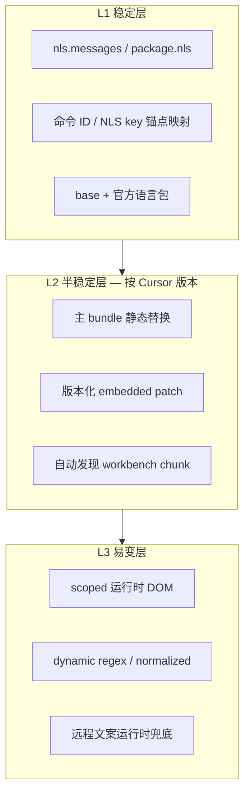

# Cursor-zh 长期可维护性改造：完整规划与验收标准

## 1. 文档目的与范围

**目的**：在不大改「patch 安装式汉化」的前提下，把维护模型从「截图驱动 + 英文锚点堆叠」升级为「分层翻译 + 自动发现漏翻 + 稳定锚点」，使 **每次 Cursor 小版本升级的人工工作量可控、可预测**。

**范围**：本仓库 `scripts/`、`translations/`、CLI、`verify/ensure` 流程、CI；**不包含**官方 Cursor 合作、远程文案源改造。

**非目标**：

- 不做运行时中英文切换
- 不追求 bundle 内 0 英文（技术标识、模型名、skill 名等允许保留）
- 不一次性重写全部 ~900 条 `cursor-win.common.json`

---

## 2. 现状与问题（共识基线）

| 维度 | 现状 | 维护痛点 |
|------|------|----------|
| 映射模型 | `originalText` exact 为主 + 部分 embedded patch | 英文改写 → 静默失效 |
| 翻译管线 | 静态 bundle 替换 + 运行时 DOM（performance 默认） | 静态失效未必有运行时兜底 |
| 覆盖率 | `analyzeCursorWinCoverage`：已有映射是否仍在 bundle 中 | **不能发现新版本新增英文** |
| Chunk | `listAuxiliaryWorkbenchBundles` 手工维护 | 漏 chunk（如 automations） |
| 发版流程 | round N 测试 + 截图 | 人力不可扩展 |
| 用户更新 | `ensure` 可重建，但无「该补哪些词」清单 | 用户仍先看到英文 |

**北极星指标**：Cursor 小版本升级后，维护者 **审一份 diff 报告 + 补映射 < 1 个工作日**；关键契约面 **CI 必绿**。

---

## 3. 目标架构（三层模型）



### 3.1 分层职责

| 层 | 承载内容 | 变更频率 | 失效表现 |
|----|----------|----------|----------|
| **L1** | VS Code/Cursor NLS、Glass 命令 `id`、nls `x(n)` | 低 | 键不变则英文变仍有效 |
| **L2** | glass/desktop 主 bundle、lazy chunk 静态字面量 | 中（每大/小版本） | 契约测试失败 / harvest `changed` |
| **L3** | 命令面板、Glass 菜单、Composer、产品卡片、远程弹窗 | 高 | harvest `added` + 运行时未命中 |

### 3.2 设计原则（写入后续 AGENTS / 贡献规范）

1. **新 UI 默认 L3**，确认稳定后再下沉 L2。
2. **禁止**无 scope 的全局短词映射（`Mode`、`Agent` 等）。
3. **每个 embedded patch** 必须带 `cursorVersionRange` 或归入版本 patch 目录。
4. **契约面**（约 25–35 项）阻塞发版；其余仅进报告，不阻塞。
5. 用户更新标准流程：**完全退出 → `ensure` →（有报告则补映射）→ 重启**。

---

## 4. 总体实施路线（6 个阶段）

| 阶段 | 名称 | 周期（估） | 依赖 | 人力主攻 |
|------|------|------------|------|----------|
| **P0** | 治理与契约固化 | 1 周 | 无 | 规范 + 小改 |
| **P1** | 字符串采集与版本 diff | 2–3 周 | P0 | 新 analyzer + CLI |
| **P2** | Workbench chunk 自动发现 | 1–2 周 | P1 | patcher 扩展 |
| **P3** | 锚点映射（command id / nls） | 3–4 周 | P1 | mapping 模型 + 静态应用 |
| **P4** | 表面分级与 L3 默认策略 | 2–3 周 | P3 | runtime-config + 映射元数据 |
| **P5** | 版本化 patch 包 | 2 周 | P2、P3 | translations 目录重组 |
| **P6** | 运行时映射池与体积优化 | 2–3 周 | P4 | runtime-selector 拆分 |

**建议并行**：P1 与 P0；P2 在 P1 后半启动；P3 与 P2 部分重叠。

---

## 5. 分阶段实施方案

### P0：治理与契约固化

**目标**：把「什么必须永远对」写死，停止 `critical-ui-targets` 无节制膨胀。

**工作项**：

1. 定义 **`SURFACE_CONTRACTS`**（扩展现有 `KEY_SURFACE_PATCH_CONTRACTS`）
   - 表面：`composer`、`model_picker`、`extension_cache_dialog`、`logout_dialog`、`settings_search`、…
   - 每项：`id`、`surface`、`severity`（error/warning）、`staticAnchor` 或 `runtimeScope`。
2. 从 `CRITICAL_UI_ALL_TARGETS` **收敛**为契约面 + round 测试仅保留契约回归，非契约改由 harvest 覆盖。
3. 文档：本文件 + `AGENTS.md` 维护章节。
4. `verify` 输出增加：**契约面摘要**（已有，强化展示）。

**涉及模块**：

- `scripts/lib/patcher/contracts.js`
- `scripts/lib/mapping/critical-ui-targets.js`（标记 `contract` vs `legacy`）
- `AGENTS.md`

**验收标准（P0）**：

| ID | 标准 | 验证方式 |
|----|------|----------|
| P0-1 | 契约面清单 ≥20 项，均有 `surface` + `severity` | 单元测试枚举契约 |
| P0-2 | `apply` 在契约 miss 且 `severity=error` 时失败或明确告警（与现 `search_models` 一致） | 集成测试 |
| P0-3 | AGENTS.md 含「更新后 ensure 流程」与「禁止全局短词映射」 | 人工 review |
| P0-4 | `npm test` 全绿，契约测试不读取全量 51MB（fixture 片段） | CI |

---

### P1：字符串采集（harvest）与版本 diff

**目标**：Cursor 更新后 **一条命令** 产出「新增/改写/删除」英文 UI 串，替代截图 round。

**工作项**：

1. **`scripts/lib/analyzer/string-harvest.js`**
   - 输入：workbench 源文件列表（路径 + 内容或按需读盘）。
   - 扫描：`out/vs/workbench/**/*.js`（大小上限可配置，默认跳过 >30MB 非 workbench）。
   - 提取规则（启发式）：
     - 引号字面量 + 上下文权重：`title:`、`label:`、`placeholder:`、`heading:`、`children:`、`original:`、`glassCategory:`。
     - 过滤：URL、hash、className、纯符号、长度 <2 或 >200、全大写常量等。
   - 输出结构：

```json
{
  "cursorVersion": "3.9.8",
  "vscodeVersion": "1.105.1",
  "generatedAt": "ISO",
  "files": [{ "path": "...", "strings": [{ "text", "context", "lineHint" }] }],
  "anchors": [{ "type": "glassCommand", "id", "field", "text" }]
}
```

2. **`scripts/lib/analyzer/coverage-reverse.js`**（反向覆盖率）
   - 输入：harvest 结果 + 合并映射 + 已翻译 bundle（可选）。
   - 分类：`covered_static` | `covered_runtime` | `covered_dynamic` | `unmapped`。
   - 排除：已在 L1 NLS 覆盖的键（可选二期）。

3. **`scripts/lib/analyzer/harvest-diff.js`**
   - 对比 `state/harvest-snapshots/{cursorVersion}.json` 与上一版。
   - 输出：`added`、`removed`、`changed`（文本变但 anchor 同 → `changed_anchor_stable`）。

4. **CLI**：`node scripts/cursor-zh-tool.js harvest`
   - 选项：`--install-dir`、`--out`、`--diff`、`--save-snapshot`
   - 正式命令加入 `OFFICIAL_COMMANDS`（与 `verify` 同级）。

5. **报告**：`state/reports/harvest-{cursorVersion}.json` + 人类可读 `harvest-{cursorVersion}.md`（Top N unmapped）。

6. **`verify` 集成（轻量）**：若存在上一版 snapshot，打印 `新增未覆盖 N 条（见 report）`，**不阻塞**（P0 契约仍阻塞）。

**涉及模块**：

- 新建 `scripts/lib/analyzer/string-harvest.js`、`harvest-diff.js`、`coverage-reverse.js`
- `scripts/tool/commands-harvest.js` 或并入 `commands.js`
- `scripts/tool/context.js`（官方命令）
- `scripts/tool/paths.js`（report 路径）
- `scripts/tests/lib/string-harvest.test.js`（fixture 片段，禁止全量 glass 进单测）

**验收标准（P1）**：

| ID | 标准 | 验证方式 |
|----|------|----------|
| P1-1 | `harvest` 对 fixture 安装目录成功，<60s（glass 存在时） | 本地/CI fixture |
| P1-2 | 能识别已知串：`Toggle Expand Agent`、`Copy as Markdown`、`Extend Cursor with Plugins` | 单元测试 fixture |
| P1-3 | 能识别 anchor：`Ns({id:..., title:"..."})` 至少 1 条 | 单元测试 |
| P1-4 | `children:[t.length," Queued"]` 出现在 harvest 或 anchor 上下文，而非误报 `1 Queued` | 单元测试 |
| P1-5 | `--diff` 对两 fixture snapshot 输出正确 `added/removed/changed` | 单元测试 |
| P1-6 | reverse coverage：`unmapped` 含未映射串；已映射串为 `covered_static` | 单元测试 |
| P1-7 | 报告写入 `state/reports/`，`verify` 打印摘要行 | 集成测试 |
| P1-8 | `npm test` 全绿；新增测试不依赖 51MB 全文件读入（除 optional 慢测标记） | CI |

**Cursor 小版本升级作业流（P1 完成后）**：

```powershell
# 1. 用户侧
完全退出 Cursor → 安装新版 Cursor

# 2. 维护者侧
node scripts/cursor-zh-tool.js harvest --install-dir "D:\Apps\cursor" --save-snapshot --diff

# 3. 仅处理 report 中 added/changed
# 4. npm test && apply && verify
```

---

### P2：Workbench chunk 自动发现

**目标**：不再手工加 `AUTOMATIONS_WORKBENCH_BUNDLE`；凡 `workbench.*.js` 且含 UI 字面量，纳入翻译与 harvest。

**工作项**：

1. **`discoverWorkbenchBundles(resourcesAppDir)`**
   - 扫描 `out/vs/workbench/**/*.js`
   - 规则：文件名匹配 `workbench*.js`，排除 `*_translated.js`、已知 vendor 垃圾（可配置 denylist）。
   - 与 `listPrimaryWorkbenchBundles` 合并去重；primary 仍优先 bootstrap 重定向。

2. **`generateAuxiliaryWorkbenchChunks`** 改为基于发现列表；bootstrap `listWorkbenchBundles()` 同步。

3. **harvest** 与 **apply** 共用同一发现逻辑（单一数据源 `workbench-bundle-registry.js`）。

4. **契约**：至少发现 `glass`、`desktop`；fixture 含 automations 时发现第三 chunk。

**验收标准（P2）**：

| ID | 标准 | 验证方式 |
|----|------|----------|
| P2-1 | 发现列表包含 glass、desktop、automations（当文件存在） | 单元 + 集成 |
| P2-2 | 新 mock chunk `workbench.anysphere-ui-foo.js` 被自动翻译并写入 `_translated.js` | 集成测试 |
| P2-3 | bootstrap 重定向列表与发现列表一致 | `bootstrap-glass.test.js` |
| P2-4 | `uninstall` 删除所有 `*_translated.js`（发现的 chunk） | 集成测试 |
| P2-5 | harvest 扫描范围与 apply 翻译范围一致（同一 registry） | 单元测试 |

---

### P3：锚点映射（command id / nls key）

**目标**：Glass 命令英文改写时，翻译仍通过 **稳定 id** 生效。

**工作项**：

1. **映射 schema 扩展**（与现有 JSON 并存，merge 层识别）：

```json
{
  "anchorType": "glassCommand",
  "anchorId": "D5h",
  "field": "title",
  "changeText": "切换展开智能体",
  "searchType": "anchor"
}
```

```json
{
  "anchorType": "nls",
  "anchorId": "5365",
  "field": "original",
  "changeText": "打开自定义",
  "searchType": "anchor"
}
```

2. **`scripts/lib/mapping/anchor-index.js`**：从 bundle 构建 `id → {field, text, span}` 索引（harvest 复用）。

3. **`scripts/lib/patcher/anchor-static.js`**：在静态翻译 **前或后** 应用 anchor 替换（邻域替换 `title:"..."` 在 `id:XXX` 附近），避免全局误伤。

4. **`scripts/lib/patcher/runtime-selector.js`**：anchor 映射导出为 runtime 候选（当静态邻域未命中）。

5. **新文件 `translations/overlay/cursor-win.anchors.json`**（或并入 common 带 `searchType: anchor`）；defaults 同步。

6. **迁移工具**：`node scripts/cursor-zh-tool.js migrate-anchors --suggest`
   - 从 harvest anchors + 现有 common 匹配，生成草稿（不自动写生产）。

7. **首批迁移**：round 27/28 高频命令 ≥30 条迁到 anchor。

**验收标准（P3）**：

| ID | 标准 | 验证方式 |
|----|------|----------|
| P3-1 | anchor 映射在 fixture 中替换 `Ns({id:D5h,title:"Toggle Expand Agent"})` 为中文 title | 单元测试 |
| P3-2 | 仅改 title 英文、id 不变时，anchor 仍命中；exact `originalText` 失效 | 单元测试 |
| P3-3 | `migrate-anchors --suggest` 输出 JSON，含 id 与建议中文 | 单元测试 |
| P3-4 | mergeMappings 后 anchor 与 exact 不冲突（同 id 以 overlay 为准） | mapping.test |
| P3-5 | apply + verify 通过；契约面仍绿 | 集成测试 |
| P3-6 | 文档说明 anchor 优先于 exact 新增流程 | AGENTS.md |

---

### P4：表面分级与 L3 默认策略

**目标**：易变 UI 默认运行时兜底，减少静态失效暴露面。

**工作项**：

1. **`translations/meta/surfaces.json`** 定义表面：

```json
{
  "command_palette": { "defaultLayer": "L3", "runtimeScopes": ["..."] },
  "glass_menu": { "defaultLayer": "L3" },
  "composer_toolbar": { "defaultLayer": "L2", "contract": true },
  "plugins_onboarding": { "defaultLayer": "L3" }
}
```

2. **映射元数据**：`surface` 字段（可选）；无则按启发式或 L2。

3. **`buildRuntimeConfig` / `selectRuntimeMappings`**：
   - L3 表面映射 **优先进入 runtime**（即使 bundle 有字面量也可 `forceRuntime` 批量标记）。
   - 与 performance 模式 scope 对齐扩展（命令面板、Glass 侧栏菜单等选择器）。

4. **harvest reverse coverage**：按 surface 统计 unmapped。

**验收标准（P4）**：

| ID | 标准 | 验证方式 |
|----|------|----------|
| P4-1 | `command_palette` 类映射在 static 故意失效时，runtime 仍显示中文（fixture DOM 或 hook 测试） | patcher-runtime.test |
| P4-2 | performance 模式下 L3 表面 scope 数 ≥8（可配置） | runtime-config.test |
| P4-3 | 新增映射若 surface=L3，默认 `forceRuntime: true`（工厂/seed） | overlay-seed.test |
| P4-4 | harvest 报告按 surface 分组 unmapped | 单元测试 |
| P4-5 | 默认 performance；compatibility 行为不变 | 回归测试 |

---

### P5：版本化 patch 包

**目标**：embedded patch 与 Cursor 版本绑定，避免 `j.length`/`t.length` 跨版本误伤。

**工作项**：

1. 目录结构：

```text
translations/patches/
  cursor-3.9/
    embedded-ui.json   # [{ from, to, surfaces[], note }]
  cursor-3.10/
    embedded-ui.json
```

2. **`loadEmbeddedPatchesForVersion(cursorVersion)`**：major.minor 匹配，fallback 到 `cursor-3.9` 或 `generic`。

3. **`CRITICAL_EMBEDDED_UI_PATCHES`** 拆为：**generic**（长期有效）+ **versioned**（加载）。

4. harvest diff 在版本升级时输出 **`patch_orphaned`**：patch `from` 在新 bundle 不存在。

5. apply manifest 记录 `patchPackVersion`。

**验收标准（P5）**：

| ID | 标准 | 验证方式 |
|----|------|----------|
| P5-1 | 3.9 安装加载 `cursor-3.9` patch；mock 3.10 加载 3.10 | 单元测试 |
| P5-2 | 错误版本 patch 不应用（`from` 不存在则跳过 + 报告） | 单元测试 |
| P5-3 | `t.length Queued` patch 仅在对应版本目录 | 文件布局 review |
| P5-4 | manifest 含 `patchPackVersion` | manifest.test |
| P5-5 | harvest diff 报告 `patch_orphaned` | 单元测试 |

---

### P6：运行时映射池与体积优化

**目标**：runtime header 可控（当前约 135KB / 880 条），避免无限增长。

**工作项**：

1. 映射分池：`static-only`、`runtime-general`、`runtime-by-surface`。
2. `selectRuntimeMappings` 只加载：未静态覆盖 + L3 表面 + dynamic。
3. 可选：surface 懒加载（首进 scope 再注入子集）— 仅当 P4 后体积仍 >150KB 再做。
4. verify 报告：`runtimePoolSize`、`prunedCount`（已有，加池明细）。

**验收标准（P6）**：

| ID | 标准 | 验证方式 |
|----|------|----------|
| P6-1 | 纯 L2 映射不进入 runtime header（除非 forceRuntime） | runtime-selector.test |
| P6-2 | 同映射集下 runtime 条数 ≤ P6 前基线或体积降 ≥10% | 对比 manifest |
| P6-3 | 契约面 + L3 表面在 performance 下仍中文 | 契约 + runtime 测试 |
| P6-4 | `npm test` 全绿 | CI |

---

## 6. 现有资产迁移策略

| 资产 | 策略 | 完成判据 |
|------|------|----------|
| `cursor-win.common.json` ~900 exact | 冻结增长；新增走 anchor 或 L3；harvest 标 `legacy-exact` | 6 个月内 anchor+L3 新增占比 >80% |
| `critical-ui-targets.js` round 列表 | 合并进 `SURFACE_CONTRACTS`；round 测试保留契约片段 | round21–28 不再新增 |
| `CRITICAL_EMBEDDED_UI_PATCHES` | 迁入 `translations/patches/` | generic ≤30 条 |
| `cursor-win.dynamic.json` | 与 surface 元数据对齐 | 每条有 `surface` 或 `scope` |

**不迁移也可工作**：exact 映射长期保留，引擎继续支持；迁移是降本，非阻断。

---

## 7. 运维与发版流程（终态）

### 7.1 用户（每次 Cursor 更新）

1. 完全退出 Cursor
2. `start-cursor-zh.cmd` 或 `ensure`（菜单引导）
3. 完全重启 Cursor

### 7.2 维护者（cursor-zh 版本发布）

| 步骤 | 动作 |
|------|------|
| 1 | 在目标 Cursor 版本上 `harvest --save-snapshot --diff` |
| 2 | 处理 `added/changed`；anchor 优先；L3 次之；L2 谨慎 |
| 3 | 更新 version patch 目录（若有 `patch_orphaned`） |
| 4 | `npm test` 全绿 |
| 5 | fixture 集成 `apply` + `verify` |
| 6 | 打 tag `v*` 发布 ZIP |

### 7.3 CI 门禁

| 门禁 | 阻塞发版 |
|------|----------|
| `npm test` | 是 |
| 契约面 static contracts（error） | 是 |
| `product_tips_render_hook`（warning） | 否 |
| harvest vs 上一 snapshot（fixture） | 否（仅 trend） |
| PowerShell AST | 是 |

---

## 8. 总体验收标准（项目级）

在 **P1+P2+P3 完成** 后，进行一次 **真实 Cursor 小版本升级演练**（如 3.9.8 → 3.9.9 或 3.10.0），满足：

| ID | 标准 |
|----|------|
| **G-1** | 升级后运行 `harvest --diff`，维护者 **无需全界面截图** 即可获得待办列表 |
| **G-2** | 待办条数 ≤ **50**（小版本）；若 >50，报告按 surface 优先级排序 Top 30 |
| **G-3** | 契约面（≥20 项）`verify` 0 阻塞；`apply` 后用户关键路径中文：Composer 追问、设置搜索、退出登录、扩展缓存提示 |
| **G-4** | 新增 lazy chunk **无需改代码**即可被翻译（P2） |
| **G-5** | 至少 **30** 条高频命令使用 anchor，英文 title 改写后仍中文（P3 演练：手动改 fixture title） |
| **G-6** | `ensure` 在 bundle 漂移后自动重建；manifest 与安装一致 |
| **G-7** | 文档完整：维护者流程、分层原则、CLI `harvest` 说明 |
| **G-8** | `npm test` 全绿；慢测（全量 glass harvest）可选 `npm run test:slow` |

**P4–P6 完成后追加**：

| ID | 标准 |
|----|------|
| **G-9** | L3 表面（命令面板、Glass 菜单）在 static 映射删除后，中文仍显示（performance 模式） |
| **G-10** | runtime header 体积 ≤ 140KB 或较基线降 10% |
| **G-11** | 版本升级后 `patch_orphaned` 清单可在 1 小时内处理完毕 |

---

## 9. 风险与缓解

| 风险 | 影响 | 缓解 |
|------|------|------|
| harvest 误报/漏报 | 报告噪音或漏项 | 上下文加权 + denylist；人工 `harvest --review`；逐步调 heuristic |
| anchor 邻域替换误伤 | 错翻 | 限定 `id` 与 `title` 距离；契约测试；优先 id 唯一命令 |
| runtime 扩大影响性能 | 卡顿 | 默认仍 scoped；compatibility 可选；P6 体积控制 |
| 双模型映射冲突 | exact vs anchor | merge 规则：anchor 优先；同 surface 显式优先级 |
| 远程文案无法 harvest | 仍英文 | L3 regex + 产品 tip hook；文档标明不可达 |
| 迁移期两套映射重复 | 维护混乱 | `migrate-anchors` + harvest 标重复 |

---

## 10. 里程碑时间表（参考）

| 里程碑 | 内容 | 目标周 |
|--------|------|--------|
| **M1** | P0 完成 | 第 1 周 |
| **M2** | P1 harvest + diff 可用 | 第 2–3 周 |
| **M3** | P2 chunk 自动发现 | 第 4 周 |
| **M4** | P3 anchor 首批 + migrate 工具 | 第 5–7 周 |
| **G 级演练** | G-1～G-8 | 第 8 周 |
| **M5** | P4 L3 策略 | 第 9–10 周 |
| **M6** | P5 版本 patch | 第 11 周 |
| **M7** | P6 runtime 池 | 第 12–13 周 |
| **终态验收** | G-9～G-11 | 第 14 周 |

---

## 11. 建议的立即下一步

**只做一件事启动整条链路**：**P1 `harvest` CLI**（含 fixture 测试 + 报告 + `verify` 摘要行）。

不阻塞现有 round 式补翻，但下一次 Cursor 更新即可用报告代替截图。

实施顺序建议：**P0 + P1** → 真实 Cursor 升级演练（G-1～G-8）→ P4–P6。

---

## 12. 相关文档

- [AGENTS.md](../AGENTS.md) — 开发与安装流程
- 架构现状见 AGENTS.md「Translation pipeline」「Patching strategy」章节
