# Cursor-zh 模块化重构 — 分批实施计划

> **For agentic workers:** REQUIRED SUB-SKILL: Use superpowers:executing-plans (recommended) or superpowers:subagent-driven-development to implement phase-by-phase.
>
> **Git（自动）：** 每个 Phase 验收通过后，Agent **必须立即自动执行** `git add` + `git commit`（见 [Agent 自动提交流程](#agent-自动提交流程)），**不得**等待用户再说「提交」；`git push` 仍仅在用户明确要求时执行。分支：`refactor/modular`。
>
> Steps use checkbox (`- [ ]`) syntax for tracking.
>
> **Related:** 详细模块清单与函数迁移映射见 [`2026-06-07-modular-refactor.md`](./2026-06-07-modular-refactor.md)。本文档侧重 **分批边界、注意事项、验收规则**。

**Goal:** 将 `scripts/cursor-zh-lib.js` 与 `scripts/cursor-zh-tool.js` 从「上帝模块 + 全能 CLI」重构为领域边界清晰的三层结构（`lib/` + `tool/` + `translations/`），每批可独立 review/merge，全程保持行为不变。

**Architecture:**

- `lib/`：纯函数翻译引擎、映射工具、覆盖率分析、运行时代码生成（不写入 Cursor 安装目录）
- `tool/`：CLI 命令解析、安装探测、文件系统 IO、构建编排、验证报告
- `translations/`：所有默认映射外置为 JSON；`defaults/` 为种子源，`overlay/` 为用户工作副本

**Tech Stack:** Node.js 18+，CommonJS，内置 `node:test`，无外部依赖。

**Branch:** `refactor/modular`

---

## 0. 总原则

| 原则 | 说明 |
|------|------|
| **行为不变** | 重构只改结构，不改翻译结果、补丁策略、CLI 命令语义 |
| **Facade 优先** | 每批保持 `cursor-zh-lib.js` / `cursor-zh-tool.js` 对外 API 不变，测试与 `.cmd` 入口无需立刻改 |
| **一批一 PR** | 每批结束必须 `npm test` 全绿，可单独 review / revert |
| **Phase 4 起 TDD** | 每个 tool 子模块 **先写失败单测 → 最小实现 → 重构**；禁止 extract 脚本批量搬迁（见 [§3 测试策略](#3-测试策略)） |
| **一批自动 commit** | 每 Phase 验收通过后 Agent **自动** `git commit`；工作区 clean 后才可进入下一 Phase |
| **push 需明示** | 自动 commit 不含 push；仅用户要求时再 `git push -u origin refactor/modular` |
| **先数据、后 lib、再 tool** | 风险从低到高；runtime bundle 生成器最后动 |
| **不碰安全不变量** | `main.js` 必须字节级不变；不提交 `cursor/`、`state/` |

### 目标架构（终态）

```
scripts/
├── cursor-zh-lib.js          # facade，< 10 行
├── cursor-zh-tool.js         # CLI 壳，< 20 行
├── cursor-zh-config.js       # 不动
├── lib/                      # 纯领域逻辑
│   ├── index.js
│   ├── mapping/   data, factory, parser, merge, version
│   ├── engine/    normalize, translator, substring
│   ├── patcher/   static, contracts, runtime-selector
│   ├── runtime/   bundle-builder, text-translator-template, footprint
│   └── analyzer/  cursor-win, dynamic, product-tips
└── tool/                     # CLI 编排
    ├── index.js
    ├── context, detector, io, backup, locale, manifest, verify, ...
    ├── builder/   main, nls, workbench, bootstrap, extension
    └── runtime-*/ toggle, report, coverage, ...
```

### 批次依赖关系

```mermaid
flowchart LR
  P0[Phase 0] --> C0[auto commit]
  C0 --> P1[Phase 1]
  P1 --> C1[auto commit x2-3]
  C1 --> P2[Phase 2]
  P2 --> C2[auto commit]
  C2 --> P3[Phase 3]
  P3 --> C3[auto commit x2-3]
  C3 --> P4[Phase 4]
  P4 --> C4[auto commit]
  C4 --> P5[Phase 5]
  P5 --> C5[auto commit]
  C5 --> P6[Phase 6]
  P6 --> C6[auto commit]
  C6 --> PR[用户可选 push/PR]
```



### 当前基线（Phase 6 完成后）

| 文件 | 行数 | 状态 |
|------|------|------|
| `scripts/cursor-zh-lib.js` | 1 | facade |
| `scripts/cursor-zh-tool.js` | 3 | CLI 壳 |
| `scripts/tool/index.js` | ~85 | 命令调度 |
| `scripts/lib/runtime/text-translator-template.js` | ~300 | 入口 + preamble；类体在 `template/` |
| `scripts/lib/runtime/template/class-*.js` | <420 | TextTranslator 类模板片段 |
| `scripts/tests/lib/**` | 4 文件 | mapping / engine / analyzer / patcher-runtime |
| `npm test` | 88/88 | Phase 0–6 已验收；遗留拆分后仍 88/88 |

---

## Git 分批提交规范

> **硬性要求：** 完成某个 Phase 的全部验收项后，Agent **在同一会话内自动完成 git 提交**（无需用户二次确认），再开始下一 Phase。未 commit 或 `git status` 仍有本 Phase 改动时，**禁止**进入下一阶段。

### Agent 自动提交流程

每个 Phase 的 **最后一步**（Steps 末尾固定追加）：

```text
验收表全部通过 → npm test → git status / diff 自检 → git add（按 Phase 路径）→ git commit → git status（须 clean）→ 汇报 commit hash
```

Agent 执行 checklist（**全部勾选后才算 Phase 完成**）：

- [ ] **Auto-test:** `npm test` 通过（Phase 5 额外 `verify`；Phase 3 额外 bundle hash）
- [ ] **Auto-stage:** 仅 `git add` 本 Phase 允许的路径（禁止 `git add .`）
- [ ] **Auto-commit:** 使用本文档该 Phase「Git 提交要求」中的 message（Phase 内多 commit 则按顺序逐个执行）
- [ ] **Auto-verify:** `git log -1 --oneline` + `git status` 无 unstaged/untracked 的本 Phase 文件
- [ ] **Auto-report:** 向用户汇报：`Phase N 完成 · commit <hash> · <subject>`

**授权说明：** 用户要求按本计划执行 refactor，即视为授权各 Phase 验收通过后的 **自动 commit**；无需每批再问「要不要提交」。

**禁止：**

- 验收未通过就 commit
- 跨 Phase 攒改动一次性 commit
- 未经用户要求 `git push`、`git commit --amend`（hook 例外见下）、改 `git config`
- 使用 `--no-verify` 跳过 hook（除非用户明确要求）

**Pre-commit hook 失败时：** 修复问题后 **新建 commit**，不要 amend 已 push 的 commit；若 HEAD 为本 Agent 刚创建且未 push，可 amend 纳入 hook 自动修改的文件。

### 标准 Phase 收尾命令模板（Agent 复制执行）

```powershell
# 1. 验收测试
npm test

# 2. 自检（禁止 add 违规路径）
git status
git diff --stat

# 3. 按 Phase 暂存（示例：Phase 0，替换为当前 Phase 路径）
git add scripts/cursor-zh-lib.js scripts/lib/mapping/data.js

# 4. 提交（message 见各 Phase「Git 提交要求」）
git commit -m "fix(lib): wire default mapping loader to data.js"

# 5. 确认 clean
git status
git log -1 --oneline --stat
```

Phase 内多个 commit 时：**重复步骤 3–5**，每个 commit 后都跑 `npm test`。

### 分支策略

| 层级 | 名称 | 用途 |
|------|------|------|
| 长期集成分支 | `refactor/modular` | 所有 Phase 的顺序集成；从 `main` 拉出，最终 PR 回 `main` |
| 可选子分支 | `refactor/modular-phase-N` | Phase 3+ 风险高时，可在子分支完成后再 merge 到 `refactor/modular` |
| 禁止 | 直接在 `main` 上堆 refactor | 便于 review 与整体 revert |

推荐流程：

```text
main
 └── refactor/modular          ← 当前工作分支
      ├── commit: phase-0 …
      ├── commit: phase-1 …
      …
      └── PR → main（全部 Phase 完成后，或按 Phase 分批 PR）
```

### Commit 消息格式

与仓库现有风格一致，使用 **Conventional Commits**：

```text
<type>(<scope>): <简短说明>

[可选正文：验收命令、风险说明]
```

| type | 用于 |
|------|------|
| `refactor` | 结构拆分、模块迁移（各 Phase 主体） |
| `fix` | 修复半重构断裂、测试失败（Phase 0、Phase 1 测试修复） |
| `test` | 仅测试文件重组（Phase 6） |
| `docs` | 仅文档（AGENTS.md 等） |
| `chore` | 删除一次性脚本、移动 dev 工具 |

**scope 建议：** `lib`、`tool`、`mapping`、`runtime`、`tests`、`plan`

**Phase 与 message 对照表：**

| Phase | 推荐 commit subject（可复制） |
|-------|--------------------------------|
| 0 | `fix(lib): wire default mapping loader to data.js` |
| 1a | `refactor(mapping): add authoritative defaults JSON seeds` |
| 1b | `refactor(tool): unify seedOverlayFiles with defaults directory` |
| 1c | `fix(tests): remove hardcoded runtimeMappingCount expectations` |
| 2 | `refactor(lib): split mapping engine and analyzer modules` |
| 3a | `refactor(lib): extract patcher modules from cursor-zh-lib` |
| 3b | `refactor(runtime): extract bundle builder and browser template` |
| 4 | `refactor(tool): extract io context detector and backup layers` |
| 5 | `refactor(tool): split builders commands and CLI shell` |
| 6 | `test: reorganize lib unit tests and update AGENTS.md` |

### 每 Phase 提交前检查清单（Agent 自动执行，全部满足才可 `git commit`）

- [ ] 该 Phase 验收表 **全部** 通过
- [ ] 已运行 `npm test` 且输出已粘贴到 PR / 工作笔记（可选）
- [ ] `git status` 无 `.gitignore` 违规文件（见下表）
- [ ] 未修改 `git config`；未使用 `--no-verify` / `--amend`（除非 hook 自动改文件且需 amend 自己的上一 commit）
- [ ] commit 只包含 **本 Phase 范围** 内文件；不夹带下一 Phase 的 WIP
- [ ] **Auto-report:** 已向用户输出 commit hash 与 subject

### 禁止提交的路径

以下路径 **不得** 出现在 `git add` 中（已在 `.gitignore` 或属运行产物）：

| 路径 | 原因 |
|------|------|
| `cursor/` | 本地 Cursor 安装副本 |
| `state/` | 生成物、备份、manifest |
| `dist/` | 发布包 |
| `node_modules/` | 依赖 |
| `.codegraph/` | 本地工具缓存（若未 intentionally 纳入版本控制） |
| `*.lnk` | 快捷方式 |

提交前自检：

```powershell
git status
git diff --stat
git diff --cached --stat
```

### 暂存（staging）规则

```powershell
# 只 add 本 Phase 明确列出的路径，避免 git add .
git add scripts/cursor-zh-lib.js scripts/lib/mapping/data.js
git status
npm test
git commit -m "fix(lib): wire default mapping loader to data.js"
```

| 规则 | 说明 |
|------|------|
| **禁止** `git add .` | 容易误加 `state/`、未跟踪 junk |
| **数据与代码分 commit** | Phase 1 必须先 commit JSON，再 commit JS/测试 |
| **机械搬迁单独 commit** | Phase 3 先 commit patcher，再 commit runtime template（便于 revert） |
| **一 Phase 多 commit 时** | 每个 commit 后运行 `npm test`；最后一个 commit 打 Phase checkpoint |

### Phase 内允许多 commit 的场景

| Phase | 最少 commit 数 | 建议拆分 |
|-------|----------------|----------|
| 0 | 1 | — |
| 1 | **2–3** | ① defaults JSON ② seed/loader 代码 ③ 集成测试修复 |
| 2 | 1–4 | 可按 `mapping` → `engine` → `analyzer` 分 3 个 commit |
| 3 | **2–3** | ① patcher ② runtime template ③ facade + lib/index |
| 4 | 1–2 | ① io/context/detector ② backup/locale |
| 5 | 1–3 | ① builder ② manifest/verify ③ index + CLI 壳 |
| 6 | 1–2 | ① 测试迁移 ② docs + 删废弃脚本 |

### 提交后验证（每个 Phase 自动执行）

```powershell
git log -1 --stat
git status          # 须 working tree clean（仅允许与下一 Phase 无关的 untracked）
npm test            # clean tree 上再跑一遍
```

**Phase 未完成定义：** 验收表未全绿 **或** 未 auto-commit **或** `git status` 仍含本 Phase 已修改未提交文件。

### 与 PR 的关系

- **最小粒度：** 1 Phase = 1 PR（从 `refactor/modular` 上切 `refactor/modular-phase-N` 或使用 cherry-pick 范围）
- **最大粒度：** 全部 Phase 完成后，`refactor/modular` → `main` 一个 PR（适合单人连续开发）
- **推荐：** Phase 0–2 合并为一个 PR，Phase 3 单独 PR（runtime 高风险），Phase 4–6 一个 PR

每个 PR 描述 **必须** 包含：

```markdown
## Phase N: <名称>
## Commits
- <hash> <subject>
## 验收
- [ ] npm test: <通过数>/<总数>
- [ ] 本 Phase 验收表 N.x 全部勾选
## 风险点
## 回滚
git revert <hash>  # 或 revert 整个 PR merge commit
```

### 回滚与 commit 边界

- 每个 Phase 的 **最后一个 commit** 应使仓库处于可运行状态；回滚单个 Phase = revert 该 Phase 的全部 commit（从新到旧）。
- Phase 1 若 JSON commit 与代码 commit 已分离，可只 revert 代码 commit 而保留 defaults 数据。
- **禁止** force push 到 `main`；仅 force push 自己的 feature 分支时需团队同意。

---

## Phase 0：修复当前半重构状态（阻塞项）

**目标：** 恢复可运行基线，否则后续批次无法验收。

### 范围

- 修改：`scripts/cursor-zh-lib.js`
- 删除或归档：`scripts/safe-replace-mappings.js`（一次性脚本，不应留在主流程）
- 确认：`scripts/lib/mapping/data.js` 路径正确

### 步骤

- [ ] **Step 0.1:** 在 `cursor-zh-lib.js` 顶部添加对 `data.js` 的 require（别名 `loadDefault*`）
- [ ] **Step 0.2:** 修复 `defaultOverlayMappings()` 与相邻函数之间缺失换行（当前 `{}function` 粘连）
- [ ] **Step 0.3:** 确认 `data.js` 中 `resolveDefaultsDir()` 指向 `translations/overlay/defaults/`
- [ ] **Step 0.4:** 运行全量测试
- [ ] **Step 0.5（自动 Git）:** 按 [Phase 0 Git 提交要求](#git-提交要求-1) 执行 `git add` + `git commit`；`git status` clean 后汇报 hash

### 代码示例

```js
const {
  defaultCursorWinCommonMappings: loadDefaultCursorWinCommonMappings,
  defaultCursorWinDynamicMappings: loadDefaultCursorWinDynamicMappings,
  defaultOverlayMappings: loadDefaultOverlayMappings,
} = require('./lib/mapping/data.js');
```

### 注意事项

- **不要**在此阶段大改 JSON 内容，只接线 loader。
- `safe-replace-mappings.js` 若需保留，移到 `scripts/dev/` 或加注释说明「仅一次性迁移用」，避免再次被误跑。
- 此阶段 **不** 统一 `overlay/` 与 `defaults/` 条目数差异，留到 Phase 1。

### 验收规则

| # | 检查项 | 命令 / 标准 |
|---|--------|-------------|
| 0.1 | lib 测试无 `ReferenceError` | `node --test scripts/tests/cursor-zh-lib.test.js` 无 loadDefault 相关错误 |
| 0.2 | 三个 default* 函数返回数组 | 临时脚本调用，长度 > 0 |
| 0.3 | facade 导出不变 | `Object.keys(require('./scripts/cursor-zh-lib.js'))` 与重构前一致（22 个 key） |
| 0.4 | 全量测试 | 至少 lib + config 全绿；integration 失败需记录 |
| 0.5 | **自动 Git** | commit 已创建；`git status` clean；已汇报 hash |

**Checkpoint:** `phase-0-loader-wired`

### Git 提交要求（Agent 验收通过后 **自动执行**，无需用户确认）

| 项 | 要求 |
|----|------|
| 执行方 | **Agent 自动** `git add` + `git commit` |
| 时机 | 验收 0.1–0.5 全部通过后立即执行 |
| commit 数 | 1 |
| 暂存路径 | `scripts/cursor-zh-lib.js`；若移动脚本则含 `scripts/dev/safe-replace-mappings.js`（或删除该文件的 commit） |
| message | `fix(lib): wire default mapping loader to data.js` |
| 禁止 | 本 commit 不含 `defaults/` JSON 大改（属 Phase 1） |

```powershell
git add scripts/cursor-zh-lib.js scripts/lib/mapping/data.js
# 若归档一次性脚本：
# git add scripts/dev/safe-replace-mappings.js
# git rm scripts/safe-replace-mappings.js
npm test
git commit -m "fix(lib): wire default mapping loader to data.js"
```

---

## Phase 1：翻译数据层统一（解除数据与代码耦合）

**目标：** 明确「defaults = 种子源、overlay = 用户可改工作副本」，消除双源漂移；修复集成测试中硬编码 `runtimeMappingCount`。

### 范围

| 操作 | 文件 |
|------|------|
| 规范 | `translations/overlay/defaults/*.json`（权威种子） |
| 只读引用 | `scripts/lib/mapping/data.js` |
| 调整 | `cursor-zh-tool.js` 中 `seedOverlayFiles` / `syncJsonArrayFileWithDefaults` |
| 修复测试 | `cursor-zh-tool.integration.test.js` 中硬编码 `runtimeMappingCount` |

### 数据流（目标语义）

```
defaults/*.json  ──seed/merge──►  overlay/*.json  ──load──►  loadMergedMappings()
     (仓库内权威)                    (首次生成+用户覆盖)              (构建时使用)
```

### 步骤

- [ ] **Step 1.1:** 审计 defaults 完整性（以 git 历史或当前 overlay 为参照）
- [ ] **Step 1.2:** 统一 seed 逻辑 — `seedOverlayFiles()` 只从 `defaults/` 读取，通过 `mergeMappings(defaults, existing)` 合并到 `overlay/`
- [ ] **Step 1.3:** 删除 lib 内任何残留的大数组字面量（契约常量 `STATIC_SOURCE_PATCHES` 等暂保留）
- [ ] **Step 1.4:** 修复集成测试 — 移除固定数字比较，改为 `runtimeMappingCount > 0` 且 manifest 与 artifact 一致
- [ ] **Step 1.5:** （可选）为 defaults JSON 加 lightweight 校验：每条必有 `originalText`、`changeText`、`searchType`
- [ ] **Step 1.6:** 运行 `npm test`
- [ ] **Step 1.7（自动 Git）:** 按顺序执行 2–3 个 auto-commit（JSON → 代码 → 测试）；汇报全部 hash

### 注意事项

- JSON 中 **保持 `\uXXXX` 转义**，不要批量转成中文，避免无意义 mega-diff。
- `mergeMappings` 的「后者覆盖前者」顺序必须与现行为一致，改顺序等于改产品行为。
- **不要**删除用户已有的 `overlay/*.json` 自定义；seed 必须是 merge 而非 overwrite。
- `cursor-win.common.json` 体积大（~80KB）属正常；此阶段不拆文件。

### 验收规则

| # | 检查项 | 标准 |
|---|--------|------|
| 1.1 | 全量测试 | `npm test` → 全部通过 |
| 1.2 | 数据单一来源 | `default*Mappings()` 仅通过 `data.js` → `defaults/` 加载，lib 内无大数组字面量 |
| 1.3 | seed 幂等 | 连续两次 `seedOverlayFiles()` 不丢用户 overlay 条目、不重复 key |
| 1.4 | 条目结构 | 随机抽 10 条 mapping，含 `originalText/changeText/searchType` |
| 1.5 | 集成测试无 magic number | `grep runtimeMappingCount.*355` 结果为 0 |
| 1.6 | **自动 Git** | 2–3 个 commit 已创建；`git status` clean；已汇报 hash |

**Checkpoint:** `phase-1-data-externalized`

### Git 提交要求（Agent 验收通过后 **自动执行**，无需用户确认）

| 项 | 要求 |
|----|------|
| 执行方 | **Agent 自动** 顺序执行 2–3 个 commit |
| 时机 | 验收 1.1–1.6 全部通过后立即执行 |
| commit 1 | 仅 `translations/overlay/defaults/*.json` |
| commit 2 | `scripts/lib/mapping/data.js`、`scripts/cursor-zh-lib.js`、`scripts/cursor-zh-tool.js`（seed 逻辑） |
| commit 3（可选） | `scripts/tests/cursor-zh-tool.integration.test.js` 测试修复 |
| message 1 | `refactor(mapping): add authoritative defaults JSON seeds` |
| message 2 | `refactor(tool): unify seedOverlayFiles with defaults directory` |
| message 3 | `fix(tests): remove hardcoded runtimeMappingCount expectations` |
| 禁止 | 单个 commit 混合「万行 JSON + 代码」；禁止 `git add translations/overlay/cursor-win.common.json` 除非 intentionally 同步种子（通常只改 defaults） |

```powershell
git add translations/overlay/defaults/
git commit -m "refactor(mapping): add authoritative defaults JSON seeds"
npm test
git add scripts/lib/mapping/data.js scripts/cursor-zh-lib.js scripts/cursor-zh-tool.js
git commit -m "refactor(tool): unify seedOverlayFiles with defaults directory"
git add scripts/tests/cursor-zh-tool.integration.test.js
git commit -m "fix(tests): remove hardcoded runtimeMappingCount expectations"
npm test
```

---

## Phase 2：拆分 lib — 低风险领域（mapping / engine / analyzer）

**目标：** 把 lib 中 **与 runtime bundle 无关** 的部分迁到子模块；`cursor-zh-lib.js` 暂保留未迁移部分。

### 范围

| 模块 | 源函数 | 目标文件 | 预估行数 |
|------|--------|----------|----------|
| mapping | `createMapping*` 系列 | `lib/mapping/factory.js` | ~30 |
| mapping | `parseJsonc`, `parseLegacyWorktreeMappings`, `LEGACY_MAPPING_PATTERN` | `lib/mapping/parser.js` | ~80 |
| mapping | `parseVersionParts`, `compareLanguagePackVersion`, `withLocaleSetting` | `lib/mapping/version.js` | ~30 |
| mapping | `mappingKey`, `mergeMappings` | `lib/mapping/merge.js` | ~20 |
| engine | `normalizeTextForComparison` | `lib/engine/normalize.js` | ~15 |
| engine | `escapeRegExp`, substring 相关 | `lib/engine/substring.js` | ~80 |
| engine | `translateTextWithMappings`, `createTextTranslator` | `lib/engine/translator.js` | ~120 |
| analyzer | `analyze*Coverage`, `*CoverageTargets` | `lib/analyzer/*.js` | ~150 |

### 步骤

- [ ] **Step 2.1:** 创建 `scripts/lib/index.js`，先只 re-export 已迁移模块 + 仍留在旧文件的符号
- [ ] **Step 2.2:** 按上表顺序逐文件迁移（每迁一个文件跑一次 lib 测试）
- [ ] **Step 2.3:** Phase 2 结束时 lib 仍含 patcher/runtime 未拆部分
- [ ] **Step 2.4:** 运行 `npm test`
- [ ] **Step 2.5（自动 Git）:** auto-commit；汇报 hash

### 注意事项

- **依赖方向：** `analyzer` → `engine` → `mapping`，禁止反向 require。
- `translateTextWithMappings` 与 `selectRuntimeMappings` 有交叉依赖，Phase 2 **不要**动 `selectRuntimeMappings`（留给 Phase 3 patcher）。
- 每步迁移后运行 **完整** lib 测试，不要只跑单个 test。
- 保持 `module.exports` 的 22 个 key 集合必须一致。

### 验收规则

| # | 检查项 | 标准 |
|---|--------|------|
| 2.1 | 全量测试 | `npm test` 全绿 |
| 2.2 | 新模块行数 | 每个 `lib/mapping/*`、`lib/engine/*`、`lib/analyzer/*` **< 200 行** |
| 2.3 | lib 瘦身 | `cursor-zh-lib.js` 行数 **< 1400**（runtime 块仍在） |
| 2.4 | 无循环依赖 | `node -e "require('./scripts/lib/index.js')"` 不报错 |
| 2.5 | 行为快照 | 选 3 个 lib 测试输出与 Phase 1 结束后一致 |
| 2.6 | **自动 Git** | commit 已创建；`git status` clean；已汇报 hash |

**Checkpoint:** `phase-2-lib-low-risk-split`

### Git 提交要求（Agent 验收通过后 **自动执行**，无需用户确认）

| 项 | 要求 |
|----|------|
| 执行方 | **Agent 自动** `git add` + `git commit` |
| 时机 | 验收 2.1–2.6 全部通过后立即执行 |
| commit 数 | 1（推荐）或 3（mapping / engine / analyzer 各一） |
| 暂存路径 | `scripts/lib/**` 新增模块；`scripts/cursor-zh-lib.js` 瘦身改动；若有 `scripts/lib/index.js` 部分聚合 |
| message | `refactor(lib): split mapping engine and analyzer modules` |
| 禁止 | 本 Phase commit 不含 `lib/patcher/`、`lib/runtime/`（属 Phase 3） |

```powershell
git add scripts/lib/mapping/ scripts/lib/engine/ scripts/lib/analyzer/ scripts/lib/index.js scripts/cursor-zh-lib.js
npm test
git commit -m "refactor(lib): split mapping engine and analyzer modules"
```

---

## Phase 3：拆分 lib — 高风险领域（patcher / runtime）

**目标：** 拆分静态补丁、契约评估、以及 **~1087 行的 `buildTranslatedWorkbenchBundle`**。

### 范围

| 模块 | 内容 | 目标文件 |
|------|------|----------|
| patcher | `STATIC_SOURCE_PATCHES`, `applyStatic*`, `sourceHasQuotedLiteral` | `lib/patcher/static.js` |
| patcher | `KEY_SURFACE_*`, `evaluatePatchContracts`, `summarizeStaticPatchContracts*` | `lib/patcher/contracts.js` |
| patcher | `selectRuntimeMappings`, `productTipScopedMappings`, scope 相关 | `lib/patcher/runtime-selector.js` |
| runtime | 浏览器端 TextTranslator / MutationObserver 字符串 | `lib/runtime/text-translator-template.js` |
| runtime | `buildTranslatedWorkbenchBundle`, `serializeMappings` | `lib/runtime/bundle-builder.js` |
| runtime | `summarizeRuntimeFootprint` | `lib/runtime/footprint.js` |

### 步骤

- [ ] **Step 3.1:** 提取 `text-translator-template.js`（参数化 diagnostics / toggle 开关）
- [ ] **Step 3.2:** `bundle-builder.js` 调用 template，保持生成字符串 **字节级一致**
- [ ] **Step 3.3:** 迁移 patcher 三块（static / contracts / runtime-selector）
- [ ] **Step 3.4:** 将 `cursor-zh-lib.js` 改为 `module.exports = require('./lib/index.js');`
- [ ] **Step 3.5:** `lib/index.js` 完整聚合 22 个导出
- [ ] **Step 3.6:** 运行 `npm test` + bundle golden hash 对比
- [ ] **Step 3.7（自动 Git）:** 按顺序 2–3 个 auto-commit（patcher → runtime → facade）；汇报全部 hash

### 注意事项

- **禁止**在 template 提取时「顺手优化」浏览器端逻辑；第一批只做机械搬迁。
- 对 `buildTranslatedWorkbenchBundle` 相关测试（lib.test 中约 10+ 条）每条迁移后立刻跑。
- `applyStaticSourceTranslations` 中的 product tip hook 字符串补丁与 `KEY_SURFACE_PATCH_CONTRACTS` 必须留在同一 conceptual 域，避免拆散后漏改。
- 若生成 bundle 与 golden sample 不一致，用 `sha256` 对比 Phase 2 结束时的 sample 定位 diff。

### 验收规则

| # | 检查项 | 标准 |
|---|--------|------|
| 3.1 | 全量测试 | `npm test` 全绿 |
| 3.2 | facade 行数 | `cursor-zh-lib.js` **≤ 5 行** |
| 3.3 | 最大子模块 | 任意 `lib/**/*.js` **≤ 500 行** |
| 3.4 | bundle 一致性 | 固定 fixture 下 `buildTranslatedWorkbenchBundle` 输出 hash 与 Phase 2 基线相同 |
| 3.5 | 导出完整 | facade 22 个 export 全部存在 |
| 3.6 | 静态契约 | `evaluatePatchContracts` 相关 lib 测试通过 |
| 3.7 | **自动 Git** | 2–3 个 commit 已创建；`git status` clean；已汇报 hash |

**Checkpoint:** `phase-3-lib-complete`

### Git 提交要求（Agent 验收通过后 **自动执行**，无需用户确认）

| 项 | 要求 |
|----|------|
| 执行方 | **Agent 自动** 顺序执行 2–3 个 commit |
| 时机 | 验收 3.1–3.7 全部通过后立即执行 |
| commit 1 | `scripts/lib/patcher/**` |
| commit 2 | `scripts/lib/runtime/**` |
| commit 3 | `scripts/cursor-zh-lib.js` facade + `scripts/lib/index.js` 完整导出 |
| message 1 | `refactor(lib): extract patcher modules from cursor-zh-lib` |
| message 2 | `refactor(runtime): extract bundle builder and browser template` |
| message 3 | `refactor(lib): replace cursor-zh-lib with lib facade` |
| 禁止 | 与 Phase 4 tool 改动混在同一 commit |

```powershell
git add scripts/lib/patcher/
npm test
git commit -m "refactor(lib): extract patcher modules from cursor-zh-lib"
git add scripts/lib/runtime/
npm test
git commit -m "refactor(runtime): extract bundle builder and browser template"
git add scripts/cursor-zh-lib.js scripts/lib/index.js
npm test
git commit -m "refactor(lib): replace cursor-zh-lib with lib facade"
```

---

## Phase 4：拆分 tool — 基础层（io / context / detector / locale）

**目标：** 剥离无业务编排的「基础设施」，降低 `cursor-zh-tool.js` 体积，为命令层拆分做准备。

### 范围

| 模块 | 函数群 | 目标 |
|------|--------|------|
| `tool/io.js` | read/write JSON、sha256、ensureDir、fileCache | 纯 IO |
| `tool/context.js` | createContext、命令白名单、路径常量注入 | 接受 paths 对象 |
| `tool/detector.js` | detectCursorInstallDir、findLanguagePack | 只读探测 |
| `tool/locale.js` | readArgvConfig、writeLocaleFiles | locale 文件 |
| `tool/overlay-seed.js` | seedOverlayFiles、syncJsonArrayFileWithDefaults | 与 backup / loadMergedMappings 共用，避免循环依赖 |
| `tool/backup.js` | ensureBackup、getManaged*Files | 备份 |

### TDD 循环（每个子模块重复 RED → GREEN → REFACTOR）

| 顺序 | 模块 | 测试文件（先写） | 实现文件 |
|------|------|------------------|----------|
| 1 | paths | `scripts/tests/tool/paths.test.js` | `scripts/tool/paths.js` |
| 2 | io | `scripts/tests/tool/io.test.js` | `scripts/tool/io.js` |
| 3 | context | `scripts/tests/tool/context.test.js` | `scripts/tool/context.js` |
| 4 | detector | `scripts/tests/tool/detector.test.js` | `scripts/tool/detector.js` |
| 5 | locale | `scripts/tests/tool/locale.test.js` | `scripts/tool/locale.js` |
| 6 | overlay-seed | `scripts/tests/tool/overlay-seed.test.js` | `scripts/tool/overlay-seed.js` |
| 7 | backup | `scripts/tests/tool/backup.test.js` | `scripts/tool/backup.js` |

**RED：** 新增测试并 `node --test scripts/tests/tool/<name>.test.js`，确认失败原因正确（模块不存在或行为未实现）。

**GREEN：** 从 `cursor-zh-tool.js` 剪切最小代码到 `scripts/tool/<name>.js`，测试通过后再改 tool 为 `require`。

**REFACTOR：** 去重复、注入依赖（如 `detectCursorInstallDir`、`seedOverlayFiles`），保持测试全绿。

每完成一个子模块：`npm test`（全量）→ 可选 interim commit 或 Phase 末一次性 commit（见 Git 要求）。

### 步骤

- [ ] **Step 4.1:** TDD `paths.js` — `createToolPaths(workspaceRoot)` 集中路径常量
- [ ] **Step 4.2:** TDD `io.js` — read/write JSON、sha256、ensureDir、timestampLabel
- [ ] **Step 4.3:** TDD `context.js` — createContext、命令白名单（注入 detector）
- [ ] **Step 4.4:** TDD `detector.js` — detectCursorInstallDir、findLanguagePack
- [ ] **Step 4.5:** TDD `locale.js` — readArgvConfig、writeLocaleFiles
- [ ] **Step 4.6:** TDD `overlay-seed.js` — seedOverlayFiles、syncJsonArrayFileWithDefaults
- [ ] **Step 4.7:** TDD `backup.js` — ensureBackup、getManaged*Files
- [ ] **Step 4.8:** `cursor-zh-tool.js` 改为 require 上述模块；**不迁移** `runApply` / `main()` switch
- [ ] **Step 4.9:** 运行 `npm test` + `node scripts/cursor-zh-tool.js verify`
- [ ] **Step 4.10（自动 Git）:** auto-commit；汇报 hash

### 注意事项

- tool 层 **可以** `require('fs')`；lib 层 **不应** 写 Cursor 安装目录（data.js 只读 defaults 除外）。
- `detectCursorInstallDir` 依赖 Windows 路径启发式，迁移时勿改探测顺序。
- fileCache 若有模块级 mutable state，保持在单例模块内，不要复制多份 cache。

### 验收规则

| # | 检查项 | 标准 |
|---|--------|------|
| 4.1 | 全量测试 | `npm test` 全绿（含 `scripts/tests/tool/*.test.js`） |
| 4.1b | TDD 覆盖 | paths / io / context / detector / locale / overlay-seed / backup 各有独立测试文件 |
| 4.2 | tool 瘦身 | `cursor-zh-tool.js` **< 1200 行** |
| 4.3 | CLI 冒烟 | `node scripts/cursor-zh-tool.js verify` 正常退出 |
| 4.4 | 无循环依赖 | `node -e "require('./scripts/cursor-zh-tool.js')"` 不报错 |
| 4.5 | apply.cmd 仍可用 | npm scripts 与 `.cmd` 入口路径未变 |
| 4.6 | **自动 Git** | commit 已创建；`git status` clean；已汇报 hash |

**Checkpoint:** `phase-4-tool-foundation`

### Git 提交要求（Agent 验收通过后 **自动执行**，无需用户确认）

| 项 | 要求 |
|----|------|
| 执行方 | **Agent 自动** `git add` + `git commit` |
| 时机 | 验收 4.1–4.6 全部通过后立即执行 |
| commit 数 | **2**（推荐） |
| commit 1 | `scripts/tests/tool/**` + `scripts/tool/{paths,io,detector,context,locale}.js` + `package.json` |
| commit 2 | `scripts/tool/{overlay-seed,backup}.js` + `scripts/cursor-zh-tool.js` |
| message 1 | `test(tool): add unit tests and extract paths io detector context locale` |
| message 2 | `refactor(tool): extract overlay seed backup layers and wire tool modules` |
| 禁止 | 本 commit 不含 `runApply` / `tool/index.js` 命令 switch（属 Phase 5） |

```powershell
git add scripts/tool/ scripts/tests/tool/
git add scripts/cursor-zh-tool.js package.json
npm test
node scripts/cursor-zh-tool.js verify
git commit -m "refactor(tool): extract io context detector and backup layers"
```

---

## Phase 5：拆分 tool — 构建与命令层

**目标：** 完成 builder / coverage / manifest / verify / report / toggle；`cursor-zh-tool.js` 变为 CLI 壳。

### 范围

```
tool/builder/     main, nls, workbench, bootstrap, extension
tool/coverage.js
tool/runtime-mode.js, runtime-strategy.js, runtime-artifact.js, runtime-budget.js
tool/manifest.js, verify.js, report.js, toggle.js
tool/index.js     runApply, runVerify, runEnsure, runStart, toggle 系列, main()
```

### 步骤

- [ ] **Step 5.1:** 迁移 builder（workbench 只调用 lib，不复制逻辑）
- [ ] **Step 5.2:** 迁移 manifest + verify
- [ ] **Step 5.3:** 迁移 report + coverage
- [ ] **Step 5.4:** 迁移 toggle 实验命令 + `tool/index.js` switch
- [ ] **Step 5.5:** `cursor-zh-tool.js` 终态为 CLI 壳（见下方示例）
- [ ] **Step 5.6:** 运行 `npm test` + CLI 四命令冒烟
- [ ] **Step 5.7（自动 Git）:** 1–3 个 auto-commit；汇报全部 hash

### CLI 壳终态

```js
#!/usr/bin/env node
if (process.stdout?.setBlocking) process.stdout.setBlocking(true);
require('./tool/index.js').main();
```

### 注意事项

- `runApply` 顺序必须保持：backup → locale → bootstrap → main → workbench → nls → extension → manifest → shortcut。
- `main.js` **字节级不变** invariant：builder/main.js 中不得对原始 main 做翻译改写。
- integration test 若直接 require 内部函数，此阶段改为从 `tool/*.js` 公共导出导入。
- `seedOverlayFiles` 已在 Phase 1 稳定，此阶段只移动位置不改语义。

### 验收规则

| # | 检查项 | 标准 |
|---|--------|------|
| 5.1 | 全量测试 | `npm test` 全绿 |
| 5.2 | CLI 壳 | `cursor-zh-tool.js` **≤ 20 行** |
| 5.3 | 命令调度 | `tool/index.js` **≤ 300 行** |
| 5.4 | 子模块大小 | 任意 `tool/**/*.js` **≤ 500 行** |
| 5.5 | 四命令冒烟 | `verify`、`ensure`、`apply`、`start` 在文档环境可测 |
| 5.6 | PS 解析 | CI 中 `scripts/*.ps1` AST 解析通过 |
| 5.7 | **自动 Git** | 1–3 个 commit 已创建；`git status` clean；已汇报 hash |

**Checkpoint:** `phase-5-tool-complete`

### Git 提交要求（Agent 验收通过后 **自动执行**，无需用户确认）

| 项 | 要求 |
|----|------|
| 执行方 | **Agent 自动** 顺序执行 1–3 个 commit |
| 时机 | 验收 5.1–5.7 全部通过后立即执行 |
| commit 数 | 1–3 |
| commit 1（推荐） | `scripts/tool/builder/**`、`coverage.js`、`runtime-*.js` |
| commit 2 | `scripts/tool/manifest.js`、`verify.js`、`report.js`、`toggle.js` |
| commit 3 | `scripts/tool/index.js` + `scripts/cursor-zh-tool.js` CLI 壳 |
| message | `refactor(tool): split builders commands and CLI shell` |
| 验证 | 每个 commit 后 `npm test`；最后一个 commit 后额外 `node scripts/cursor-zh-tool.js verify` |

```powershell
git add scripts/tool/builder/ scripts/tool/coverage.js scripts/tool/runtime-*.js
npm test
git commit -m "refactor(tool): extract build and runtime orchestration modules"
git add scripts/tool/manifest.js scripts/tool/verify.js scripts/tool/report.js scripts/tool/toggle.js
npm test
git commit -m "refactor(tool): extract manifest verify report and toggle"
git add scripts/tool/index.js scripts/cursor-zh-tool.js
npm test
node scripts/cursor-zh-tool.js verify
git commit -m "refactor(tool): thin CLI entry to tool index"
```

---

## Phase 6：测试重组、清理与终验

**目标：** 测试结构与模块对齐；删除废弃代码；文档与指标达标。

### 范围

- 新增：`scripts/tests/lib/mapping/data.test.js` 等 4 个领域单测
- 精简：`cursor-zh-lib.test.js`（保留 facade 回归 + 跨模块 E2E）
- 更新：`package.json` test 脚本
- 删除：`safe-replace-mappings.js`、lib 内 dead code
- 更新：`AGENTS.md` 架构段

### 步骤

- [ ] **Step 6.1:** 从 `cursor-zh-lib.test.js` 按领域迁移测试到 `tests/lib/**`
- [ ] **Step 6.2:** lib.test 保留 facade 完整性 + 1 条完整 bundle 端到端
- [ ] **Step 6.3:** 更新 `npm test` 注册新文件（Node 18 需显式列文件）
- [ ] **Step 6.4:** 终验清单（见下表）
- [ ] **Step 6.5:** 更新 `AGENTS.md`
- [ ] **Step 6.6（自动 Git）:** 1–2 个 auto-commit；汇报全部 hash；提示用户是否 `git push` / 开 PR

### 终验规则

| # | 类别 | 检查项 | 标准 |
|---|------|--------|------|
| 6.1 | 测试 | 全量 | `npm test` 全绿 |
| 6.2 | 体量 | facade | `cursor-zh-lib.js` < 10 行，`cursor-zh-tool.js` < 20 行 |
| 6.3 | 体量 | 子模块 | 任意 `lib/**`、`tool/**` 单文件 < 500 行 |
| 6.4 | 依赖 | 无环 | lib/tool 均可 `require` 无堆栈溢出 |
| 6.5 | 行为 | verify 输出 | 与 Phase 0 前同类环境比，关键字段语义一致 |
| 6.6 | 安全 | main 不变量 | 集成测试或 doctor 仍确认 main 未被修改 |
| 6.7 | 仓库 | 无 junk | 不提交 `state/`、`cursor/`；删除一次性迁移脚本 |
| 6.8 | 文档 | AGENTS.md | 架构段更新为 lib/tool 两层描述 |
| 6.9 | **自动 Git** | 1–2 个 commit 已创建；`git status` clean；已汇报 hash；**未**自动 push |

**Checkpoint:** `phase-6-refactor-complete`

### Git 提交要求（Agent 验收通过后 **自动执行**，无需用户确认）

| 项 | 要求 |
|----|------|
| 执行方 | **Agent 自动** 顺序执行 1–2 个 commit |
| 时机 | 终验 6.1–6.9 全部通过后立即执行 |
| push | **不自动** push；完成后询问用户是否 push / 开 PR |
| commit 数 | 1–2 |
| commit 1 | `scripts/tests/lib/**`、精简后的 `cursor-zh-lib.test.js`、`package.json` test 脚本 |
| commit 2 | `AGENTS.md`、`docs/superpowers/plans/*`；删除 `scripts/safe-replace-mappings.js` |
| message 1 | `test: reorganize lib unit tests by domain module` |
| message 2 | `docs: update architecture notes for lib tool split` |
| 合并前 | `refactor/modular` → `main` 的 PR 须列出 Phase 0–6 全部 commit hash |

```powershell
git add scripts/tests/ package.json
npm test
git commit -m "test: reorganize lib unit tests by domain module"
git add AGENTS.md docs/
git rm scripts/safe-replace-mappings.js 2>$null
git commit -m "docs: update architecture notes for lib tool split"
npm test
```

---

## 跨批次注意事项

### 1. 兼容性

- 外部入口不变：`node scripts/cursor-zh-tool.js`、`*.cmd` 包装、npm scripts。
- `require('./cursor-zh-lib.js')` 的 22 个符号名不可 rename / 删除。
- 不在重构中改 `compareLanguagePackVersion` semver 规则。

### 2. 翻译与补丁

- 静态补丁（`STATIC_SOURCE_PATCHES`）与契约（`KEY_SURFACE_PATCH_CONTRACTS`）Phase 3 前不要动内容。
- Product tip scope selector 字符串是行为契约，改一处需同步 lib.test + integration.test。

### 3. 测试策略

#### Phase 0–3（已完成）：回归安全网

- 以现有 `cursor-zh-lib.test.js` / integration 为主；迁移后跑全量 `npm test`。
- Phase 3 额外：bundle golden hash。

#### Phase 4 起：严格 TDD（REQUIRED SUB-SKILL: superpowers:test-driven-development）

```
NO PRODUCTION CODE WITHOUT A FAILING TEST FIRST
```

| 规则 | 说明 |
|------|------|
| 顺序 | 先 `scripts/tests/tool/<module>.test.js`，见失败，再 `scripts/tool/<module>.js` |
| 粒度 | 一个子模块一轮 RED-GREEN-REFACTOR；禁止 extract 脚本批量搬迁后再补测 |
| 全量门禁 | 每个子模块 GREEN 后跑 `npm test`；Phase 末再跑 `verify` |
| 依赖注入 | detector / backup 等 IO 边界用临时目录 + env 注入，避免依赖本机 Cursor 安装 |
| Phase 6 | 将已有 lib 测试迁到 `tests/lib/**`；Phase 4–5 新增的 tool 单测保留在 `tests/tool/` |

- **每批必跑：** `npm test`（config + lib + integration + **tool 单测**）。
- **Phase 5 额外：** `node scripts/cursor-zh-tool.js verify`。
- 集成测试 2109 行：Phase 6 前 **不要求** 拆完，但禁止新增硬编码 mapping 计数。

### 4. Git / PR 与 commit 汇总

完整规范见上文 **[Git 分批提交规范](#git-分批提交规范)**。此处为索引：

| Phase | 最少 commit | 合并 PR 建议 |
|-------|-------------|--------------|
| 0 | 1 | 与 Phase 1 同 PR 或单独 hotfix PR |
| 1 | 2–3 | 与 Phase 0–2 合并为「数据 + lib 基础」PR |
| 2 | 1–3 | 同上 |
| 3 | 2–3 | **单独 PR**（runtime 高风险） |
| 4 | 1–2 | 与 Phase 5–6 合并为「tool 拆分」PR |
| 5 | 1–3 | 同上 |
| 6 | 1–2 | 同上 |

| PR | 分支后缀 | 包含 Phase | 依赖 |
|----|----------|------------|------|
| PR-0 | `phase-0-loader` | 0 | main |
| PR-1 | `phase-1-data` | 1 | PR-0 |
| PR-2 | `phase-2-lib-core` | 2 | PR-1 |
| PR-3 | `phase-3-lib-runtime` | 3 | PR-2 |
| PR-4 | `phase-4-tool-base` | 4 | PR-3 |
| PR-5 | `phase-5-tool-cmd` | 5 | PR-4 |
| PR-6 | `phase-6-tests-cleanup` | 6 | PR-5 |

每 PR description 模板：

```markdown
## Phase N: <名称>
## Commits
- abc1234 fix(lib): wire default mapping loader to data.js
## 验收
- [ ] npm test: 63/63
- [ ] Phase N 验收表全部勾选
- [ ] git status clean（提交后）
## 风险点
## 回滚方式
git revert abc1234..def5678  # 或 revert merge commit
```

### 5. 回滚策略

- 每 Phase 独立 revert；Phase 3 若 bundle 出问题，优先 revert template 提取，保留 Phase 2。
- 数据 JSON 变更与代码变更 **分 commit**（Phase 1 内），便于只 revert 代码不动数据。

### 6. 明确不做（范围外）

- 不重构 `cursor-zh-tool.integration.test.js` 体量（除非 Phase 6 可选子任务）。
- 不拆分 `cursor-win.common.json` 为多文件。
- 不引入 webpack / TypeScript / 外部 test 框架。
- 不改变 balanced / performance runtime 模式默认行为。

---

## 工作量预估

| Phase | 风险 | 预估 | 可否并行 |
|-------|------|------|----------|
| 0 | 低 | 0.5h | 否（必须先做） |
| 1 | 中 | 2–4h | 否 |
| 2 | 低 | 4–6h | 否 |
| 3 | **高** | 6–10h | 否 |
| 4 | 中 | 4–6h | 否 |
| 5 | 中高 | 6–8h | 否 |
| 6 | 低 | 3–5h | 否 |

**总计约 25–40h**，Phase 3 应留足 review 与 golden 对比时间。

---

## 快速自检命令（每批粘贴运行）

```powershell
# 全量测试
npm test

# Git 提交前（每 Phase 必做）
git status
git diff --stat
git diff --cached --stat

# 导出完整性
node -e "const l=require('./scripts/cursor-zh-lib.js'); console.log(Object.keys(l).length, Object.keys(l).sort().join(', '))"

# 循环依赖 / 加载
node -e "require('./scripts/cursor-zh-lib.js'); console.log('lib OK')"
node -e "require('./scripts/cursor-zh-tool.js'); console.log('tool OK')"

# CLI 冒烟
node scripts/cursor-zh-tool.js verify

# 行数门禁（Phase 3+ 后）
@('scripts/cursor-zh-lib.js','scripts/cursor-zh-tool.js') | ForEach-Object {
  "$_ : $((Get-Content $_ | Measure-Object -Line).Lines) lines"
}
```

---

## 文件大小终态目标

| 文件 | 重构前 | 重构后目标 |
|------|--------|------------|
| `scripts/cursor-zh-lib.js` | ~3347 行 | < 10 行 |
| `scripts/cursor-zh-tool.js` | ~1978 行 | < 20 行 |
| `scripts/lib/index.js` | — | < 100 行 |
| `scripts/tool/index.js` | — | < 300 行 |
| 任意子模块 | — | < 500 行 |
